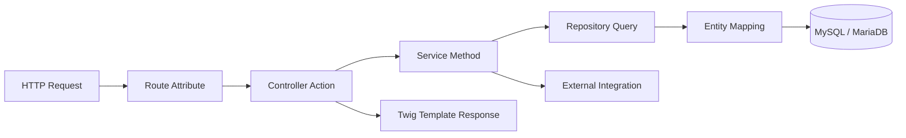

# Serinity Web

Symfony web recreation of the original JavaFX desktop forum module from serinity-desktop.

## Why This Structure Was Chosen

This project follows a layered Symfony architecture to keep responsibilities separated and make the forum module maintainable as it grows.

1. Domain and persistence are explicit.
Entity classes model forum data and relations, while repositories handle query logic.
2. Business rules stay outside controllers.
Services concentrate moderation, interactions, notifications, and thread/reply lifecycle logic.
3. Controllers stay thin.
HTTP input/output and routing are in controllers, while reusable behavior is delegated to services.
4. Configuration is declarative.
YAML files centralize framework, Doctrine, routes, and environment-specific behavior.
5. Reverse-engineering support exists for restart scenarios.
Custom commands can regenerate entities/repositories from a DB schema when rebuilding from scratch.

## Scope Rebuilt From Desktop Version

- Forum threads with full CRUD
- Categories (parent/child) with admin management
- Nested replies on thread detail
- Interactions: upvote, downvote, follow
- Notifications with read/unread handling
- Forum statistics dashboard
- Search and category filtering
- Optional translation and summarization integrations

## Tech Stack

- PHP 8.2+
- Symfony 6.4 (Flex skeleton + selected components)
- Doctrine ORM + Doctrine Migrations
- MySQL / MariaDB
- Twig + Bootstrap 5
- Symfony Forms + Validator
- Doctrine Fixtures

## What Each File Type Does

### Entity Files (src/Entity)

Purpose:
- Map PHP objects to DB tables using Doctrine attributes.
- Define fields, validation constraints, and relations.

Example responsibilities:
- Column mapping: title, content, timestamps, flags
- Relationships: Category -> ForumThread, ForumThread -> Reply
- Validation: not blank, max length, format

### Repository Files (src/Repository)

Purpose:
- Encapsulate custom DB queries.
- Keep query-builder logic out of controllers/services.

Example responsibilities:
- Feed filtering (status/type/category/search)
- Loading followed threads
- Optimized joins for rendering pages

### Service Files (src/Service)

Purpose:
- Hold business rules and use-case orchestration.
- Coordinate repositories, external APIs, and persistence.

Example responsibilities:
- Thread create/update/delete rules
- Toxicity moderation checks
- Notification dispatch and profile lookups
- Image upload workflow

### Controller Files (src/Controller)

Purpose:
- Expose HTTP endpoints and route handlers.
- Validate request flow, invoke services, return Twig responses/redirects.

Example responsibilities:
- Forum feed page
- Thread detail page with reply posting
- Admin backoffice pages

### Form Files (src/Form)

Purpose:
- Define form fields, validation mapping, and data binding.

Example responsibilities:
- Thread form (title/content/type/category)
- Reply form (content + parent reply id)
- Category form (name/slug/description/parent)

### Enum Files (src/Enum)

Purpose:
- Centralize allowed values and avoid magic strings.

Example responsibilities:
- Thread status: open, locked, archived
- Thread type: discussion, question, announcement
- Notification type variants

### Twig Templates (templates)

Purpose:
- Render UI views.
- Present read-only view logic and forms.

Example responsibilities:
- Shared layout in base.html.twig
- Feed/detail/admin pages
- Notification lists

### Migration Files (migrations)

Purpose:
- Versioned schema evolution.
- Deterministic DB setup for all environments.

### Command Files (src/Command)

Purpose:
- Provide CLI automation.
- Regenerate code from schema and bootstrap repeated tasks.

Current project commands:
- app:generate:entities (reverse-engineers entities from DB schema)
- app:generate:repositories (creates repositories for entities)

## YAML Configuration Files Explained

### config/routes.yaml

- Declares controller route loading.
- Uses attribute routing from src/Controller namespace.

### config/services.yaml

- Defines service container defaults (autowire + autoconfigure).
- Registers App namespace services.
- Holds app parameters such as upload directory and API key binding.

### config/packages/*.yaml

Each file configures one Symfony/Doctrine subsystem:

- framework.yaml: core framework behavior (sessions, http, cache basics)
- doctrine.yaml: DB connection + ORM mapping
- doctrine_migrations.yaml: migration paths and migration behavior
- twig.yaml: template paths and Twig options
- validator.yaml: validation system configuration
- messenger.yaml: async message transport setup (if used)
- monolog.yaml: logging channels/handlers
- mailer.yaml and notifier.yaml: communication channels
- translation.yaml: locale/translation configuration
- web_profiler.yaml and debug.yaml: dev tooling

## Reproducible Commands Used To Build This Project

The following sequence recreates the current structure and dependencies.

### 1) Create project

```bash
composer create-project symfony/skeleton serinity-web
cd serinity-web
```

### 2) Install core Symfony + Doctrine + UI dependencies

```bash
composer require \
	doctrine/orm doctrine/doctrine-bundle doctrine/doctrine-migrations-bundle \
	symfony/framework-bundle symfony/runtime symfony/console symfony/dotenv \
	symfony/twig-bundle twig/twig twig/extra-bundle \
	symfony/form symfony/validator symfony/translation symfony/yaml \
	symfony/asset symfony/asset-mapper symfony/stimulus-bundle symfony/ux-turbo \
	symfony/http-client symfony/mailer symfony/notifier symfony/serializer \
	symfony/monolog-bundle symfony/security-csrf symfony/process \
	symfony/property-access symfony/property-info symfony/intl \
	symfony/doctrine-messenger symfony/expression-language
```

### 3) Install dev tooling

```bash
composer require --dev \
	symfony/maker-bundle doctrine/doctrine-fixtures-bundle phpunit/phpunit \
	symfony/debug-bundle symfony/web-profiler-bundle symfony/browser-kit \
	symfony/css-selector symfony/stopwatch
```

### 4) Configure environment

Set these in .env / .env.local:

- DATABASE_URL
- APP_SECRET
- API_TRANSLATE_KEY (optional)

Example:

```env
DATABASE_URL="mysql://root:@127.0.0.1:3306/serinity_web?serverVersion=mariadb-10.4.0"
```

### 5) Build database and baseline data

```bash
php bin/console doctrine:database:create --if-not-exists
php bin/console doctrine:migrations:migrate --no-interaction
php bin/console doctrine:fixtures:load --no-interaction
```

### 6) (Optional) Regenerate from schema for fresh restarts

```bash
php bin/console app:generate:entities --dry-run
php bin/console app:generate:entities --overwrite
php bin/console app:generate:repositories --dry-run
php bin/console app:generate:repositories --overwrite
```

### 7) Run app and validations

```bash
symfony server:start
php bin/console about
php bin/console doctrine:schema:validate
php bin/console lint:twig templates
php bin/console lint:container
```

## Code Walkthrough (Real Project Snippets)

## Contributor Onboarding Flow

Use this flow when you need to understand where a feature lives or where to implement a change.



### How To Trace Any Feature Quickly

1. Start from route name in controller attributes to locate the entry point.
2. Read the controller action and identify which service methods are called.
3. Open the service and locate business rules, side effects, and transaction boundaries.
4. Follow repository calls to understand filtering, joins, and ordering.
5. Confirm entity fields/relations used by that query path.
6. Finish at the Twig template to verify what data is actually rendered.

### Fast Example Path (Forum Feed)

1. Entry route: app_forum_feed in src/Controller/ForumController.php.
2. Service call: ThreadService::feed() in src/Service/ThreadService.php.
3. Query implementation: ForumThreadRepository::findFeed() in src/Repository/ForumThreadRepository.php.
4. Display layer: templates/forum/feed.html.twig.

### 1) Entity relation mapping (Category)

From src/Entity/Category.php:

```php
#[ORM\ManyToOne(targetEntity: self::class, inversedBy: 'children')]
#[ORM\JoinColumn(onDelete: 'SET NULL')]
private ?Category $parent = null;

#[ORM\OneToMany(mappedBy: 'parent', targetEntity: self::class)]
private Collection $children;
```

Why it matters:
- Models parent-child category trees.
- Prevents cascading category deletion damage by setting child parent to null.

### 2) Repository query composition (Forum feed)

From src/Repository/ForumThreadRepository.php:

```php
$qb = $this->createQueryBuilder('t')
		->leftJoin('t.category', 'c')
		->addSelect('c')
		->orderBy('t.isPinned', 'DESC')
		->addOrderBy('t.createdAt', 'DESC');
```

Why it matters:
- Eager-loads category to reduce additional queries in Twig rendering.
- Applies deterministic sort order with pinned-first logic.

### 3) Service-level business rules (Thread save)

From src/Service/ThreadService.php:

```php
if ($this->moderationService->isToxic($thread->getTitle() ?? '') || $this->moderationService->isToxic($thread->getContent() ?? '')) {
		throw new \RuntimeException('Thread contains inappropriate content and cannot be published.');
}

$thread->setUpdatedAt(new \DateTimeImmutable());
$this->entityManager->persist($thread);
$this->entityManager->flush();
```

Why it matters:
- Keeps moderation policy outside controllers.
- Guarantees updates and persistence happen through one consistent use-case path.

### 4) Controller orchestration (Forum detail)

From src/Controller/ForumController.php:

```php
if ($form->isSubmitted() && $form->isValid()) {
		if ($thread->getStatus() === ThreadStatus::LOCKED) {
				throw $this->createAccessDeniedException('Cannot add replies to a locked thread.');
		}

		$reply->setThread($thread);
		$reply->setAuthorId($currentUser->getId());
		$replyService->add($reply, $currentUser);
}
```

Why it matters:
- Controller validates request flow and access.
- Business write operation is delegated to ReplyService.

## Default Fixture Users

- admin@serinity.local / admin123 (ROLE_ADMIN)
- alice@serinity.local / alice123 (ROLE_USER)
- bob@serinity.local / bob123 (ROLE_USER)

## Current User Fallback (Forum-only Local Mode)

You can change fallback user in src/Service/CurrentUserService.php by editing FALLBACK_USER_ID.

## Optional Integrations

- Translation: set API_TRANSLATE_KEY to enable external translation calls
- Summarization: run local Python service on http://localhost:5000/summarize
- Moderation: toxic content checks run during thread/reply operations

## Notes

- Uploaded images are stored under public/uploads.
- PDF export service exists as scaffold and can be extended with a concrete PDF library.
- Security rules can be hardened further in config/packages/security.yaml.
